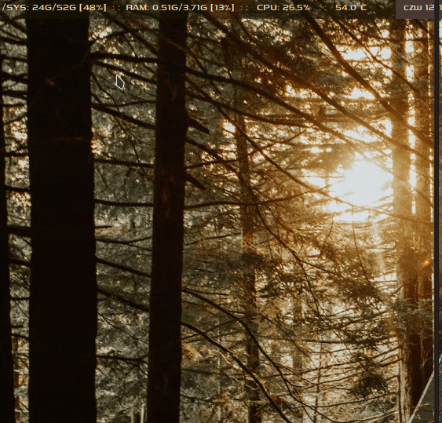

##### JGMENU SCRIPT MOUNT/UNMOUNT DEVICES - GENARATOR CSV FOR JGMENU 

The script generate data in csv format which can read  jgmenu. We get a menu with options for mounting and unmounting the following resources:
* Android devices - mtp protocol
* Optical disc rom - cd/dvd/bd
* Block devices - partitions: memory card, disks hdd, disks ssd, pendrive
* Images - iso, img, nrg, bin, mdf 

##### PRESENTATION

<<<<<<< HEAD


=======

<video src="media/mount-umount-presentation.mp4"></video>
>>>>>>> e6deff46029c2f1e691ea29f52677cd1c63d66cb
##### DEPENDENCIES

* Installed and working Jgmenu menu
* gvfs-mtp 1.50.6-1
* gvfs 1.50.6-1
* gio 2.76.4 from packet:  glib2 2.76.4-1
* findmnt from packet:  util-linux 2.39.2
* udisks2 2.9.4-4
* find from packet findutils 4.9.0-3
* fusermount from packet fuse2 2.9.9-4
* fuseiso 20070708-8
* awk

The script has been tested with above versions, but it will probably work correctly with other versions

##### INSTALATION

Copy the script to the  folder where you store jgmenu scripts. check permissions - the script must have execution permissions.
Create a script trigger in your bar configuration. J use bar polybar. Trigger in my configuration looks like this:
```
[module/disk]
type = custom/script
exec = $HOME/.config/polybar/scripts/disk/disk.sh
interval = 10
format = <label>
format-background = ${colors.background-2}
label = %output%
label-minlen = 28 
label-maxlen = 28
label-alignment = center
click-left = mount-umount-csv.sh | jgmenu --simple --icon-size=0

```
The most important line in this fragment of the configuration is, of course, the line:
```
click-left = mount-umount-csv.sh | jgmenu --simple --icon-size=0
```
This line is responsible  for running the script and  passing the  output pipe  to jgmenu program.
After left clicking on the status storage modul, the menu opens jgmenu for mounting and unmouting resources.
If this configuration is not suitable for you, you can find more in the official documentation of the above-mentioned projects:

[Jgmenu] (https://jgmenu.github.io/index.html)

[Polybar] (https://github.com/polybar/polybar)

##### CONFIGURATION

The script configuration is  located in the section config script inside the script .
The entire configuration header:
```
##################### SECTION CONFIG SCRIPT #######################
# Here you can add or del your directories for searching image files
image_scan_directories="$HOME/*iso/  $HOME/iso*/ $HOME/*image/ $HOME/image*/"
# Your mount point for all image files, in this directory each image is mounting in separated directory
image_mount_point="$HOME/image-mount-point/"
# Your favorite editor
editor="subl"
##################### END SECTION CONFIG SCRIPT ####################
```

##### ADDITIONAL CONFIGURATION

To place additional launch entries in the menu, e.g. disk analysis tools, you must add appropriate lines for the jgmenu in the script in the 
generate_csv  function, compatible  with the csv format. Of course, the programs you refer to must be installed on your system. Exercise:

```
function generate_csv()
{
printf "^sep(: : : :Mount / Umount : : : :)
Mount, ^checkout(mount), none
Umount, ^checkout(umount), none
^sep(: : : : : : : Software : : : : : : :)
 Whdd scan surface, $TERMINAL  -e sudo whdd, none
 Disk usage, $TERMINAL -e sudo dua i /, none
 Disk health - smart, gsmartcontrol-root, none
^sep(: : : : : : : : : Config : : : : : : : :)
edit fstab, $TERMINAL -e bash -c 'sudo ${gui_editor} -n /etc/fstab', none
^sep(: : : : : : : : : : : : : : : : : : : : : : : :)
^tag(mount)
^sep(: : : : : Mount Android-mtp devices : : : : : :)
${mtp_list_to_mount}
^sep(: : : : : : : Mount block partitions : : : : : : : )
${block_list_to_mount}
^sep(: : : : : : : : : Mount CD/DVD/BD : : : : : : : : )
${rom_list_to_mount}
^sep(: : : : : : : : : : : Mount ISO files : : : : : : : : : : )
${list_to_mount_image_files}
^tag(umount)
^sep(: : : : Unmount Android-mtp  devices : : : :)
${mtp_list_to_umount}
^sep( : : : : : : Unmount block partitions : : : : : : )
${block_list_to_umount}
^sep(: : : : : : : : Unmount CD/DVD/BD : : : : : : : )
${rom_list_to_umount}
^sep(: : : : : : : : : : Unmount ISO files : : : : : : : : : )
${list_to_umount_image_files}
"
}
```
##### FINAL REMARKS
Not all file systems will be supported on your system.
You check file systems supported by the kernel:
```
cat /proc/filesystems
```
You check file systems supported by the modules of kernel:


```
ls /lib/modules/$(uname -r)/kernel/fs
```
